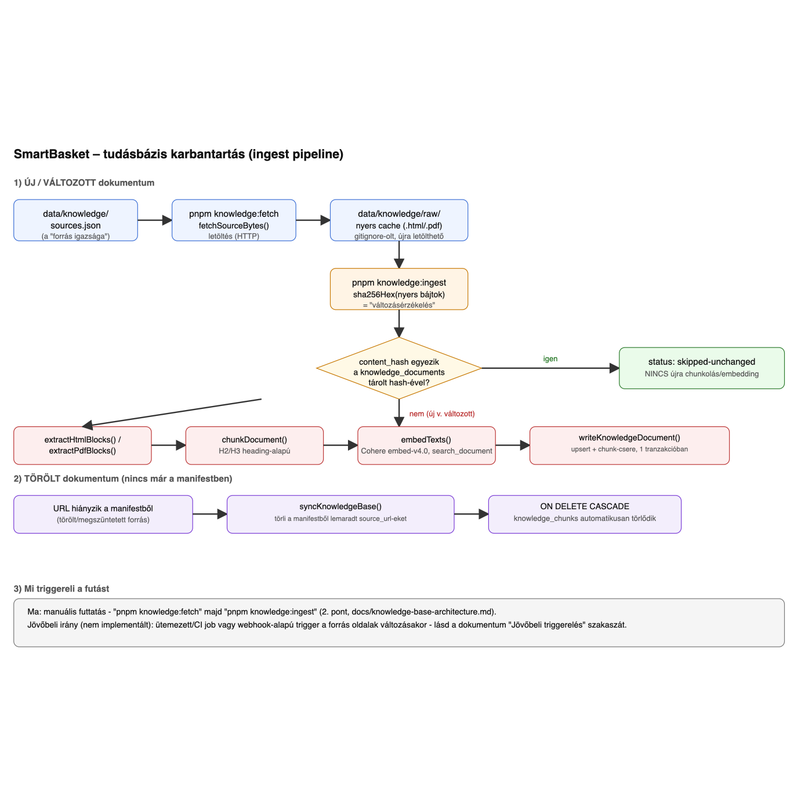

# SmartBasket Agent – Tudásbázis karbantartás (HF3 architektúra-spec)

> Ez a dokumentum a HF3 feladatleírás 5. pontjának ("Architektúra-spec: a tudásbázis
> karbantartása") felel meg. A feladat explicit mondja: "Ezt NEM kell leimplementálni."
> Ennek ellenére a mechanizmust ténylegesen megépítettük (`packages/core/src/lib/knowledge/ingest/`,
> `scripts/fetch-knowledge.ts`, `scripts/ingest-knowledge.ts`) - ez a dokumentum tehát nem egy
> elméleti terv, hanem a ténylegesen futó rendszer leírása, kód-hivatkozásokkal. A fájlnév direkt
> `knowledge-base-architecture.md` (nem `ARCHITEKTURA.md`) - a repóban már él egy
> `docs/architektura.md` (a HF1 eredeti specifikációja), és egy case-insensitive fájlrendszeren
> (alapértelmezett macOS/Windows) a két név ütközne. Ez a fájl a HF3 feladatleírás
> "docs/ARCHITEKTURA.md" leadandójának felel meg.

---

## 1. Áttekintés - a teljes adatfolyam



(Az ábra forrása szerkeszthető SVG-ként: [`assets/knowledge-base-architecture.svg`](assets/knowledge-base-architecture.svg).)

Két, egymástól független folyamat:

1. **Új/változott dokumentum**: forrás → letöltés → változásérzékelés (hash) → kinyerés →
   chunkolás → embedding → tárolás.
2. **Törölt dokumentum**: a manifestből eltávolított URL → a DB-ből törlődik a dokumentum,
   és (cascade) a hozzá tartozó chunkok is.

## 2. Honnan tudod, hogy egy dokumentum változott? (és mi NEM vektorizálódik újra)

A "forrás igazsága" a `data/knowledge/sources.json` manifest - egy `{url, title, topic,
format?}` lista (`knowledge/ingest/source-manifest.ts`). Ez **nem** figyeli automatikusan a
forrás oldalak tartalmát (nincs webhook/polling) - a változásérzékelés a manifestben felsorolt
URL-ek **újra-letöltött tartalmának hash-éből** áll elő:

1. `pnpm knowledge:fetch` (`scripts/fetch-knowledge.ts`) minden manifest-sorra letölti a nyers
   bájtokat (`fetchSourceBytes()`), és felülírja a helyi cache-t
   (`data/knowledge/raw/<cacheKey>.<html|pdf>` - a `cacheKey` az URL-ből származtatott,
   fájlrendszer-biztos azonosító, `sha256(url).slice(0, 16)`).
2. `pnpm knowledge:ingest` (`scripts/ingest-knowledge.ts` → `syncKnowledgeBase()` →
   `ingestDocument()`) a helyi cache-fájl **tartalmának** `sha256` hash-ét számolja ki
   (`content-hash.ts`), és összeveti a `knowledge_documents.content_hash` oszlopban tárolt
   értékkel (`source_url` alapján).
3. **Ha a hash egyezik**: `ingestDocument()` `status: 'skipped-unchanged'`-et ad vissza,
   **nem fut le** sem a kinyerés, sem a chunkolás, sem az embedding-hívás (Cohere API-hívás
   sem történik) - ez a "ne vektorizálódjon újra" garancia, és egyben költségvédelem is
   (lásd README költségbecslés).
4. **Ha a hash eltér** (új dokumentum vagy ténylegesen megváltozott tartalom): a teljes
   pipeline lefut (3-5. pont).

Ez determinisztikus, kódban ellenőrzött logika - nem az LLM dönti el, hogy egy dokumentum
"változott-e" (ugyanaz a tervezési elv, mint a HF1 `checkDatasetFreshness()`-nél:
`konvenciok.md` 12. pont).

**Ismert korlát (nem elméleti, ténylegesen belefutottunk):** a hash kizárólag a **forrás
nyers bájtjaira** épül, nem a mi kinyerő/chunkoló/embedding kódunkra. Ha a forrás oldal nem
változik, de MI módosítunk valamit a pipeline-ban (pl. az `extractHtmlBlocks()` boilerplate-
szűrőjén, a chunkolási szabályokon, vagy lecseréljük az embedding modellt), a hash-alapú
"skipped-unchanged" ág ezt nem érzékeli - a már betöltött dokumentum a régi (esetleg hibás)
kinyeréssel/embeddinggel marad a DB-ben, amíg valaki nem kényszerít egy újra-ingestet.
Ez pontosan így fordult elő: a portal.nebih.gov.hu sablon egy "Friss hírek" dobozt fűz az
`<article>` mellé, amit a Readability néhány oldalon (`Kapszulakamrával...`, `Ünnepi
menütervezés...`, `Maradék nélkül: karácsony`) tévesen a cikktörzs részének ítélt - egy
teljesen más témájú (állatjárvány-hír) H2 szivárgott be idegen chunk-ként. Az
`extractHtmlBlocks()` javítása (`BOILERPLATE_SELECTORS`) után a 3 érintett dokumentumot
kézzel kellett törölni a `knowledge_documents` táblából (`DELETE ... WHERE source_url = ANY(...)`),
hogy a következő `pnpm knowledge:ingest` új sorként, a javított kóddal dolgozza fel őket -
maga a forrás HTML nem változott, a hash-ük ugyanaz maradt volna.
**Következtetés a karbantartási tervhez**: pipeline-kód (extraction/chunking/embedding-modell)
módosítása esetén a hash-ellenőrzés nem elég - vagy célzottan törölni kell az érintett
dokumentum(ok) sorát ingest előtt, vagy (nagyobb, széles hatókörű kódváltozásnál, pl.
embedding-modell csere) a teljes `knowledge_documents` táblát ürítve teljes rebuildet kell
futtatni. Ez explicit emberi döntés kell legyen (kód-review/deploy checklist tétel), nem
automatizált - az automatikus verzió (pl. a pipeline-kód hash-ét is figyelembe venni a
content_hash mellett) jövőbeli irány, jelenleg nincs implementálva.

## 3. Mi történik az új dokumentummal?

Új sor a `sources.json`-ban → `pnpm knowledge:fetch` letölti → `pnpm knowledge:ingest`
lefuttatja rá a teljes pipeline-t:

1. **Kinyerés** (`extraction/`): `format: 'pdf'` esetén `extractPdfBlocks()` (unpdf),
   egyébként `extractHtmlBlocks()` (Readability + jsdom).
2. **Chunkolás** (`chunking/chunk-document.ts`): heading-aware, lásd
   `docs/rag-chunking-strategy.md`.
3. **Embedding** (`embedding/embed-texts.ts`): Cohere `embed-v4.0`, `inputType:
   'search_document'` - kötegelt hívás, egy API-hívás az összes chunkra.
4. **Írás** (`ingest/write-knowledge-document.ts`): EGY tranzakcióban - `INSERT ...
   ON CONFLICT (source_url) DO UPDATE` a `knowledge_documents` sorra, majd a dokumentum
   összes régi chunkjának törlése és az új chunkok beszúrása. Ha bármelyik lépés hibázik,
   teljes rollback (ugyanaz a minta, mint `write-product-snapshot.ts`-nél,
   `konvenciok.md` 8. pont).

## 4. Mi történik a törölt dokumentum chunkjaival?

Egy dokumentum "törlése" = **eltávolítás a `sources.json` manifestből**, nincs külön
"delete" parancs. `syncKnowledgeBase()` minden `knowledge:ingest` futáskor:

1. Összegyűjti a manifestben szereplő URL-eket.
2. Lekérdezi, mely `knowledge_documents.source_url` érték **nincs** ezek között.
3. `DELETE FROM knowledge_documents WHERE source_url = ANY($1)` - ez töröl minden ilyen
   dokumentumot.
4. A `knowledge_chunks.document_id` egy `ON DELETE CASCADE` idegen kulcs
   (`0002_knowledge_base.sql`) - a dokumentum törlésekor a Postgres **automatikusan**
   törli a hozzá tartozó chunkokat is, alkalmazáskódból nem kell külön törölni őket
   (nincs "elárvult" chunk kockázata, mert ezt nem az alkalmazáslogika, hanem a
   DB-séma kényszeríti ki).

## 5. Mikor / mi triggereli az újraindexelést?

**Jelenleg (implementált): manuális.** A karbantartó fut le kézzel:

```bash
pnpm knowledge:fetch    # újra letölti a manifest összes forrását
pnpm knowledge:ingest   # hash alapján csak a ténylegesen változottakat dolgozza fel
```

Ez a HF3 house-keeping léptékéhez (136 dokumentum, ritkán változó hivatalos
tájékoztató anyag) arányos - egy automatikus, gyakori újraindexelés ehhez a
frissülési ütemhez nem indokolt komplexitás-növelés.

**Jövőbeli irány (nem implementált, dokumentált terv):**

- **Ütemezett (cron) újrafuttatás** - pl. heti egy `knowledge:fetch && knowledge:ingest`
  CI-jobként, mert a hash-ellenőrzés miatt ez olcsó akkor is, ha semmi sem változott
  (a legtöbb futás `skipped-unchanged`-del zárul, nincs felesleges Cohere-hívás).
- **Webhook/RSS-alapú trigger**, ha a forrás oldalak (NKFH/Nébih/GVH) publikálnak ilyet -
  ezzel a manuális/ütemezett újra-letöltés is kiváltható lenne egy "csak akkor fuss, ha
  tényleg történt valami" jelzésre.
- Egyik irány sem igényelne változtatást a fenti hash-alapú "mi változott ténylegesen"
  logikán - csak azt váltanák ki, hogy *mikor* induljon el a `knowledge:fetch`.

## 6. Amit a diagram és ez a dokumentum szándékosan NEM tartalmaz

- **Nincs verziótörténet/audit log** a chunk-tartalmak korábbi állapotairól - egy
  dokumentum frissítésekor a régi chunkjai véglegesen törlődnek (4. lépés a 3. pontban).
  Ez a HF1 `products` tábla "napi snapshot, nincs történeti adat" döntésével konzisztens
  (`docs/db-migration-rationale.md`).
- **Nincs részleges/inkrementális chunk-frissítés** egy dokumentumon belül - egy tartalmi
  változásnál a teljes dokumentum összes chunkja újragenerálódik, nem próbáljuk
  diff-elni, mely chunk változott ténylegesen. Egy chunkolási stratégia-váltásnál
  (pl. a H2-határok újraszámolása) ez amúgy sem lenne megbízhatóan diff-elhető chunk
  szinten.
